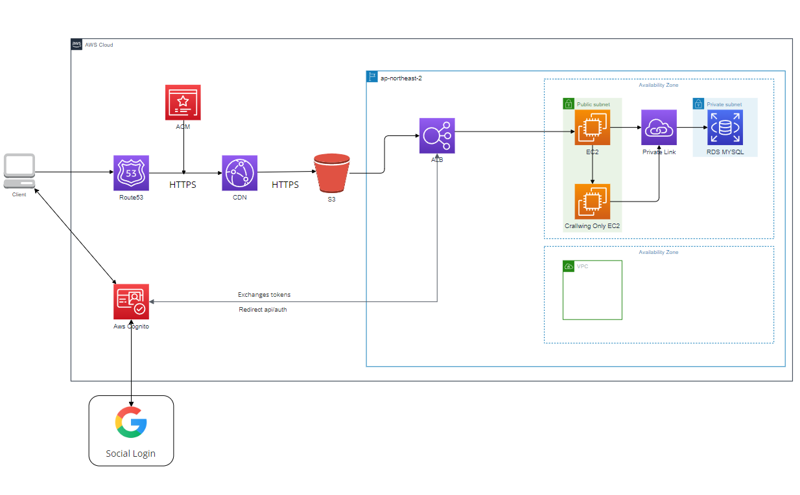
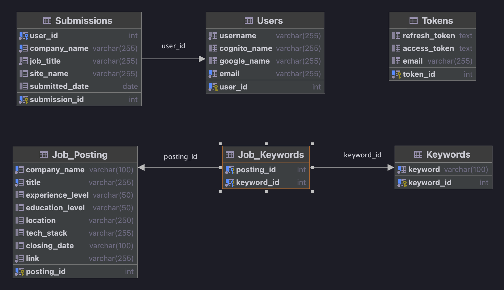

[사이트 바로가기](https://findjob.lsapee.com)

## 잡코리아 및 사람인 구인공고 크롤링

### 잡코리아 UI 변경으로 인한 크롤링 정보 부족 및 짧은 시간내 여러 공고를 보면 IP차단 당하는 것으로 인하여 중단.

### 사용법
 - 회원가입 하기 - 이메일 인증 필수 , 비밀번호는 최소 8글자 특수문자1,영문 대문자1,소문자1,숫자1 자리씩 필요
 - 로그인 하기
 - 키워드 선택 및 경력 조건 선택 후 데이터 가져오기 버튼 클릭 
 - 사람인/잡코리아의 공고명 및 회사, 경력 기술스택등 정보보고 지원할 사이트 페이지로 이동 버튼 클릭
 - 해당 사이트에서 지원 후 지원완료버튼 클릭 (보여지는 공고에서 같은 회사 공고가 전부 제외됩니다.)
 - 마이페이지로 이동하여 지원 완료 회사들 확인가능 및 지원완료 취소 가능 (지원 취소시 다시 매안페이지에서 데이터 가져오기시 해당 회사 공고들 표시)
 - 마이페이지에서 잡코리아/사람인외의 또는 해당 사이트에서 지원했던 회사/공고 추가 (보여지는 공고에서 추가한 회사 공고가 전부 제외됩니다.)

### 로컬 사용법
 - clone 혹은 Download 하기
 - npm install (node가 없다면 node 설치)
 - 현재 크롬브라우저의 버전 알아보기
 - 크롬브라우저 버전에 따른 크롬드라이버 다운로드 -[크롬브라우저 다운링크](https://chromedriver.chromium.org/downloads/version-selection)
 - 크롬 드라이버를 PATH에 추가하기
 - 잡코리아,사람인에 검색하고자 하는 검색어 입력하고 경력선택 및 버튼 클릭

### 현재 문제점 및 개선 방향성
 
 - ~~사람인 크롤링 도중에 가씀씩 input값 enter발생 하지 않는 문제 발생~~ -> 버튼클릭으로 변경하여
 - ~~중복값을 제거해야함.~~ -> 회사명+공고제목으로 유니크설정 
 - ~~새로 고침을 할 경우 데이터가 날라가서 다시 크롤링 해야함.~~ -> localStorage사용할지 react State사용 고민
 - ~~사람인이나 공고가 많은 경우에는 TimeOut 발생~~ -> DB로 해결
 - ~~node_schedule 사용하여 특정시간에 크롤링 되도록 변경~~-> 완료.
 - 사람인 사이트 크롤링 문제 -> ~~GUI를 사용하지 않으면 error page로 보내는 문제 발생~~ -> ~~직접 DB에 보내는 방법 또는 안쓰는 컴퓨터를 사용해서 작업할 예정으로 변경.~~ -> headless 우회 방법
 - ~~RDS퍼블릭 사용시 비용 발생~~ -> 프라이빗 설정 같은 VPC의 EC2->RDS 접속하는 방식으로 변경 (로컬 환경에서는 터널링을 통해서 접속)
 - ~~[aws-ubuntu 22.04 이슈 발생](https://bugs.launchpad.net/ubuntu/+source/linux-aws/+bug/2058480)~~ -> ububtu 20.04버전으로 ec2 재설정
 - ~~"경력"만 적혀있는 경력에 대한 분류 재대로 못해서 지정 필요함~~ 그냥 경력으로 변경
 - ~~Amplify+Cognito를 이용한 로그인 기능 구현중.~~ -> ~~(로그인 UI 변경 및 추가적인 고려사항으로 인하여 React 학습중)~~ -> cognito 호스팅UI 사용
 - ~~페이지 네이션 동작이 새로 검색했을때 이상해짐(React로 변경 예정)~~ -> React로 구현 수정이 필요한 부분 있음.
 - 잡코리아의 중견기업(300명이상),대기업,대기업계열사.자회사로 적힌 회사명에 대한 분류 필요
 - ~~크롤링하는데 약 1시간 30분정도 시간이 소요되며 해당 시간에 리소스 부족한 문제가 있음~~ 새로운 EC2 연결로 해소
 - ~~EC2 리소스 네트워크 문제인지 가끔 크롤링하다가 멈추는 현상 발생.~~ -> EC2를 추가하여 0시에 켜져서 크롤링 완료후 EC2가되도록 하였으나 여전히 문제 발생하여 잠시 추가한 EC2 종료해둠.
 - ~~리프레시 토큰으로 엑세스 토큰 재발급 부분에 문제가 있는지 로그인 풀리는 현상~~ -> res 세팅 하고 req에 값 변경을 하지 않아서 문제 되었던 것 해결 
 - 동시 크롤링 진행하면서 A리스너와 B리스너가 거의 동시에 같은 것을 등록하려 할떄 에러 발생하여 해당 리스너들의 1페이지 크롤링 데이터 전부 날리는 문제 발생
 - 잡코리아 리뉴얼?로 인하여 클래스 명 및 기존과 달라진 내용 일부 수정중 
### HTTPS 연결

 - AWS ALB를 이용하여 구성
 - 클라이언트 -> 도메인 입력시 80 -> 443으로 리다이렉션 443포트에서 -> 대상그룹으로 전달 하게끔 처리
 - ALB 요금 발생으로 인하여 VPC 가용영역 4->2개로 변경 - 요금 발생으로 인하여 나중에 다시 연결 예정

### CI/CD 구성

 -  github Actions 이용하여 구성
 -  main 브런치에 변동사항 있을시 github Actions 실행
 -  test 자동화 구현X
 -  ~~Login Page -> AWS Amplify를 통한 CI/CD 구성중 -> aws-exports.js가 생성되지 않는 문제 발생~~
 - Login Page -> cognito 호스팅 UI사용하기

### 현재

- ~~DB 구성 및 크롤링 데이터 처리 어떻게 할지 생각중~~ -> 날짜 데이터 추가 가공필요
- ~~DB 입력데이터로 회사명,공고제목,경력,학력,지역,기술스택,마감일,URL로 크롤링 데이터 변경~~ 수정완료
- ~~페이지네이션 처리 변경중~~
- ~~cognito 로그인 연결 + cognito를 사용한 OAuth2.0연결 확인~~ 완료
- ~~CORS 설정~~ 완료 
- ~~cognito login 후 user 테이블에 정보 넣어주기 만드는중~~
- ~~리프레시토큰으로 엑세스토큰 발급 동작 확인~~ -완료
- ~~해당공고 보지 않기 버튼 활성화~~ 완료
- ~~해당 공고 보지 않기한 공고 검색으로 가져올때 제외하는 기능 구현중~~ 완료
- ~~지난 공고 제외 기능 추가 -> 크롤링하기전에 데이터 삭제~~ 완료
- ~~크롤링을 위한 새로운 EC2 연결 및 00시에 해당 EC2 켜지게 설정~~ 완료 
- ~~지원 완료 기업에 대한 현재 현황처리 방법 생각중.~~ 완료
- ~~지원 후 30일 동안 변동사항 없을시 해당 지원내역 삭제~~ 완료
- 회원 탈퇴기능 구현 (프론트 어디에 배치할지 생각중)

### 추후 생각중인 기능
- 원티드 등 다른 구인사이트 크롤링 지원
- 직접 공고 추가 가능 -> 구인공고 사이트를 이용하지 않고 자사에만 적어두는 회사에 대한 구인공고를 적어두기 위해

### 아키텍처

**- AWS 전체 적인 이미지**

**- 로그인 구성**

**- 테이블 구성**

