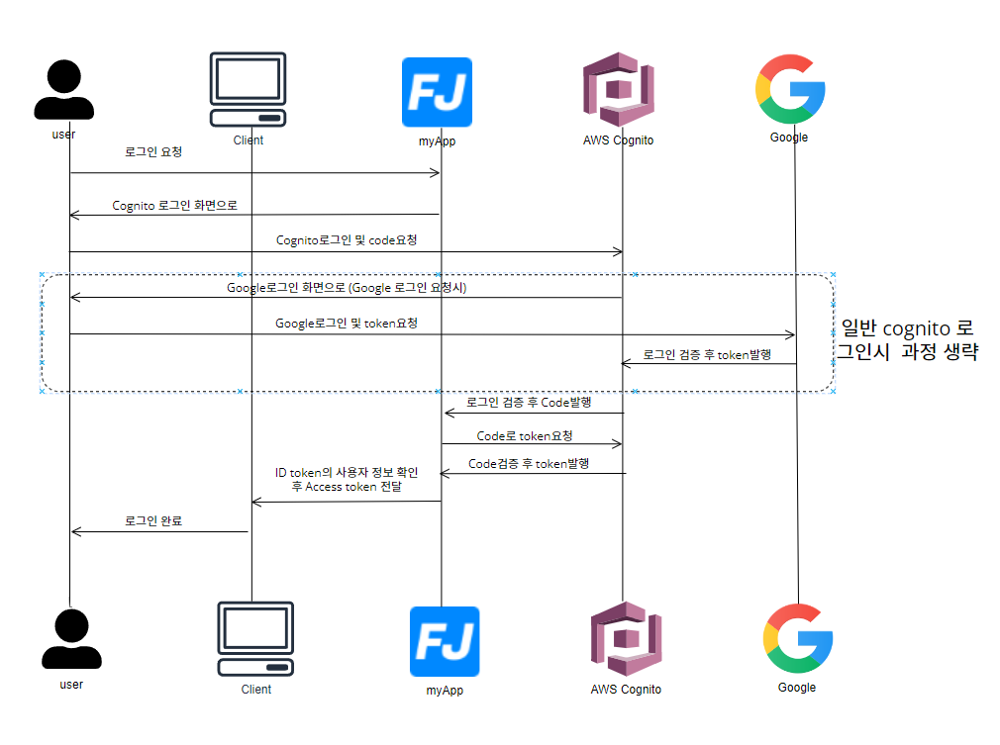

## 잡코리아 및 사람인 구인공고 크롤링

- 잡코리아 및 사람인 구인공고를 크롤링하여 보여주며, 중복 공고 제거 및 지원한 회사를 제외해주는 기능 제공.

### HTTPS 연결

 - AWS ALB를 이용하여 구성
 - 클라이언트 -> 도메인 입력시 80 -> 443으로 리다이렉션 443포트에서 -> 대상그룹으로 전달 하게끔 처리
 - ALB 요금 발생으로 인하여 VPC 가용영역 4->2개로 변경 - 요금 발생으로 인하여 나중에 다시 연결 예정

### CI/CD 구성

 -  github Actions 이용하여 구성
 -  main 브런치에 변동사항 있을시 github Actions 실행
 -  test 자동화 구현X
 - Login Page -> cognito 호스팅 UI사용하기

### 아키텍처

**- AWS 전체 적인 이미지**

**- 로그인 구성**

**- 테이블 구성**

